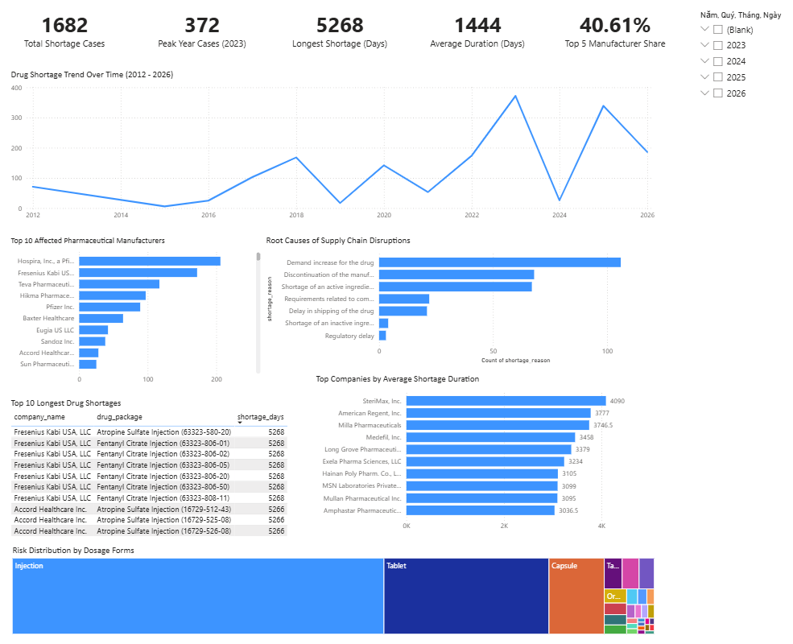

# Drug Shortage Analytics

## Project Overview

Drug shortages can significantly impact healthcare systems, patient outcomes, and pharmaceutical supply chains. This project analyzes FDA drug shortage records to identify trends, major manufacturers involved, root causes, vulnerable dosage forms, and shortage severity.

The analysis was conducted using PostgreSQL for data cleaning and analytics, and Power BI for dashboard visualization.

---

## Dashboard Preview



---

## Dataset

**Source:** FDA Drug Shortages Dataset

**Total Records:** 1,682 drug shortage cases

The dataset includes:

* Drug manufacturers
* Generic drug names
* Product information
* Shortage reasons
* Availability status
* Posting and update dates
* Dosage forms

---

## Business Questions

This project aims to answer the following questions:

1. How have drug shortages changed over time?
2. Which manufacturers are most affected by shortages?
3. What are the leading causes of drug shortages?
4. Which dosage forms face the highest shortage risk?
5. How severe are shortages in terms of duration?

---

## SQL Workflow

### 1. Data Cleaning

File: `sql/01_data_cleaning.sql`

Main tasks:

* Converted date columns from text to DATE format
* Standardized categorical values
* Corrected data entry errors
* Replaced missing values with NULL
* Created ENUM types for status and availability fields

### 2. Business Analysis

File: `sql/02_business_analysis.sql`

Analysis performed:

* Manufacturer impact analysis
* Manufacturer concentration analysis
* Root cause analysis
* Dosage form analysis
* Yearly shortage trend analysis
* Peak shortage year analysis

### 3. Advanced Analysis

File: `sql/03_advanced_analysis.sql`

Analysis performed:

* Longest shortage duration analysis
* Average shortage duration by company
* Monthly shortage trend analysis
* Product-level shortage severity analysis

---

## Key Insights

### 1. Drug Shortage Trend

* Total shortage cases: 1,682
* Peak year: 2023 with 372 cases
* Second highest year: 2025 with 339 cases
* Drug shortages increased substantially after 2021

### 2. Manufacturer Impact

Top manufacturers by shortage cases:

| Manufacturer                    | Cases |
| ------------------------------- | ----: |
| Hospira, Inc., a Pfizer Company |   206 |
| Fresenius Kabi USA, LLC         |   172 |
| Teva Pharmaceuticals USA, Inc.  |   117 |
| Hikma Pharmaceuticals USA, Inc. |    97 |
| Pfizer Inc.                     |    91 |

The top five manufacturers accounted for **40.61%** of all shortage cases.

### 3. Root Cause Analysis

| Cause                            | Cases | Percentage |
| -------------------------------- | ----: | ---------: |
| Demand increase for the drug     |   106 |     36.43% |
| Discontinuation of manufacturing |    68 |     23.37% |
| Active ingredient shortage       |    67 |     23.02% |
| GMP compliance requirements      |    22 |      7.56% |
| Shipping delays                  |    21 |      7.22% |

The top three causes accounted for **82.82%** of all identified shortage reasons.

### 4. Dosage Form Impact

| Dosage Form | Cases |
| ----------- | ----: |
| Injection   |   975 |
| Tablet      |   434 |
| Capsule     |   146 |

The top three dosage forms represented **92.45%** of all shortage cases.

### 5. Shortage Severity

* Longest shortage duration: **5,268 days**
* Average shortage duration: **1,444 days**
* Highest average shortage duration: **SteriMax Inc. (4,090 days)**

The longest shortages were primarily associated with:

* Fresenius Kabi USA, LLC
* Accord Healthcare Inc.

Products involved included:

* Fentanyl Citrate Injection
* Atropine Sulfate Injection

---

## Dashboard

The Power BI dashboard includes:

* KPI summary cards
* Yearly shortage trends
* Top manufacturers
* Root cause distribution
* Dosage form analysis
* Longest shortage cases
* Average shortage duration by manufacturer

Power BI file:

`dashboard/Drug_Shortage_Analysis_Dashboard.pbix`

---

## Business Recommendations

Based on the analysis:

1. Reduce dependency on a small group of manufacturers.
2. Improve demand forecasting for high-risk medications.
3. Strengthen active ingredient sourcing strategies.
4. Prioritize risk monitoring for injectable products.
5. Develop early warning systems for long-duration shortages.

---

## Tools Used

* PostgreSQL
* SQL
* Power BI
* GitHub

---

## Repository Structure

```text
drug-shortage-analytics/

├── dashboard/
│   └── Drug_Shortage_Analysis_Dashboard.pbix
│
├── images/
│   └── dashboard_overview.png
│
├── sql/
│   ├── 01_data_cleaning.sql
│   ├── 02_business_analysis.sql
│   ├── 03_advanced_analysis.sql
│   └── README.md
│
└── README.md
```
